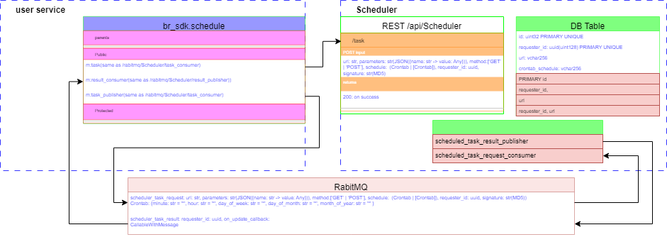

## مرحله اول – تعریف Story اعلان نیامندی توسط معمار سیستم
# Who:
معمار سیستم
# What:
به یک سیستم اسکجولر نیازداریم که بتواند حالت های بسیار فلکسیبلی از تقویم زمانبندی را ایجاد نماید. زمانبندیهای مورد نظر شامل:
- هر 10 روز و 3 ساعت یک بار
- پنجشنبه ها ساعت 17:00 
- شنبه ها ساعت 4:00 
- روز سوم هر ماه (تاریخ 3) و ساعت 15:00
- ترکیب این موارد با هم

اسکجولر لازم است قادر باشد در یک زمان از قبل تعیین شده، با فاصله زمانی حداکثر یک سال، یک وظیفه محوله را اجرا نماید. وظیفه در قالب یک فانکشن یا API است که لازم است به صورت پارامتریک و با قابلیت ارسال پارامترهای متغیر فانکشن یا API برای اسکجولر قابل تعریف کردن باشد.

قابلیت لازم است به نحوی پیاده سازی شود که برای سرویس های موجود مبتنی بر Python و C++ و C# قابل استفاده باشد. قابلیت لازم است در ساده ترین حالت ممکن در سرویس های موجود قابل استفاده باشد.

ایجاد یک کانال دسترسی به سرویس که در تمامی پلتفرمهای استفاده کننده قابل استفاده باشد، مانند Message Queue یا API یا ... قابل استفاده است.

وظایف اسکجول شده لازم است در صورت فیل شدن داکر و بازیابی خودکار توسط اینفرااستراکچر داکر/کوبرنتیز به صورت خودکار بازیابی گردد.

# Why:
برنامه نویس های بخش هایم مختلف قادر باشند در بخش های مختلف برنامه هایشان هر نوعی از اسکجول را تعریف نمایند و برای این کار کمترین زمان را رفع کنند و به دانش برنامه نویسی خارج از زبان برنامه نویسی تخصصی خود و حوزه کاری خود نیاز نداشته باشند.

تا بتوانیم انواع اسکجول متنوع از هر نوعی را در قابلیت های مختلف برنامه ایجاد کرد.
# مرحله دوم – طراحی (Story to Task)
## Functionality
### عملکردهای مورد نیاز (activity):
1. ارسال اطلاعات اسکجولد تسک از ریکوئستر به اسکجولر
2. لغو یک اسکجولد تسک – Postponed
* کنترل دسترسی با شناسه یکتای ماشین و PKI
3. لیست کردن اسکجولد تسک ها – Postponed
* کنترل دسترسی با شناسه یکتای ماشین و PKI
4. اطلاع به ریکوئستر از اجرای تسک اسکجول شده و نتیجه تسک
### نوع تسک (چه چیزی فراخوانی بشود؟):
1. یک API (route)
  * [x] GET
  * [x] POST
  * PUT: Postponed
  * HEAD: Postponed
2. یک فانکشن
* چون اسکجولر لازم است با سیستم درخواست کننده داخل یک دامین قرار بگیرند، مشکلات زیادی را تحمیل می کند از این رو Postponed.
  1. سینک
  2. ای سینک
## Usability 
با توجه به اینکه این عملکرد به عنوان یک قابلیت در SDK و پلتفرم توسعه داخلی قرار می گیرد لازم است به عنوان یک لایبراری توسط استفاده کننده قابل استفاده باشد. نام لایبرای br_sdk.schedule در نظر گرفته می شود. لازم است این کانکتورها برای آن توسعه داده شود:
* کانکتور Python برای
* کانکتور CPP
* کانکتور C# - با توجه به اینکه کد C# توسعه داده نمی شود، توسعه داده نشود.

### پروتکل ارتباطی (پارامترهای اسکجول چگونه به اسکجولر داده بشود؟):
1. API: POST
#### مزیت:
- عدم نیاز به لایبراری بیرونی (در اکسر فریمورک ها بیلت این ساپورت می شود) و ساده تر بودن کانکتور سمت استفاده کننده
- امکان دریافت نتیجه و اطمینان از رجیستر شدن اسکجول توسط اسکجولر
2. Message Queue: 
- REACT
- KAFKA – Postponed.
## Efficiency
تنظیم تاپیک‌های RabitMQ از طریق .env:
تسک ها نیازی به آتنتیکیت و آتورایز کاربر ندارند و فقط ریت لیمیت و سورس ریکوئیست آنها محدود شده است. از این رو بهتر است روتهای تسک های اسکجول جداگانه و برای همین منظور ایجاد گردد.
## Flexibility
در بخس های دیگر پوشش داده شده است:
1. تنوع در نوع تسک قابل اجرا
2. تنوع در شیوه ارتباط با اسکجولر
3. تنوع در زبان برنامه نویسی مورد استفاده در سمت ریکوئستر
## Reliability
پشتیبانی گیری از دیتای تسک ها در دیتابیس (در ساده ترین حالت ممکن  = pandas DataFrame) در یک والیوم پرسیستنت و اسکجول کردن تسک های ذخیره شده در زمان بازراه اندازی سرویس.

# معماری پیاده سازی

# Tasks
+ br_sdk.schedule.task_request_publisher(same as /rabitmq/Scheduler/task_consumer)
+ br_sdk.schedule.register_task_result_consumer(callback_function: CallableWithMessage)
- CallableWithMessage: callable(message: {status: [‘success’ | ’failed’], content: str})
+ br_sdk.schedule.task(same as /rabitmq/Scheduler/task_consumer)

+ /api/Scheduler/task(same as /rabitmq/Scheduler/task_consumer)
+ /rabitmq/Scheduler/scheduled_task_request_consumer(uri: str, parameters: str(JSON({name: str -> value: Any})), method:[‘GET’ | ‘POST’], schedule:  (Crontab | [Crontab]), requester_id: uuid, requester_signature: str(MD5))
+ Crontab: {minute: str = '*', hour: str = '*', day_of_week: str = '*', day_of_month: str = '*', month_of_year: str = '*' }
+ /rabitmq/Scheduler/scheduled_task_result_publisher(uri: str, parameters: str(JSON({name: str -> value: Any})), requester_id: uuid, scheduler_signature: str(MD5))
+ Scheduler/restore_tasks()
 
# Required Documentations for 

## Installation and Getting Started Guide. ...
## Contributor Guidelines. ...
## Code of Conduct
## API Documentation
## Release Notes
## Upgrade plan
